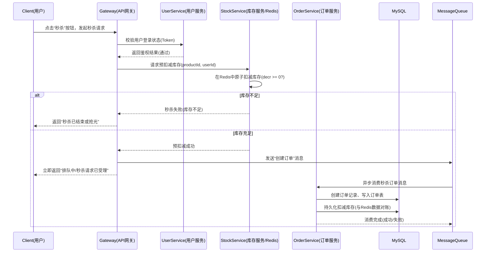

## 商品库存与秒杀系统 - 系统设计文档（草稿）

### 1. 系统背景与目标

本系统为“分布式软件原理与技术”课程的作业项目，主要场景为**电商商品库存管理与秒杀活动**。通过该系统的设计与实现，目标是理解并初步实践分布式系统的“三高”目标：

- **高并发**：在秒杀场景下同时有大量用户请求下单、扣减库存。
- **高性能**：请求需在较短时间内完成响应，减少数据库压力。
- **高可用**：关键服务在高并发和部分组件故障时仍能持续提供服务。

本次作业重点是系统架构设计与用户服务的初步实现，后续可扩展秒杀优化。

---

### 2. 整体架构设计

系统采用**微服务架构 + 分层设计**思路，将核心业务拆分为以下四个服务：

- **用户服务（User Service）**
  - 职责：用户注册、登录、鉴权、用户信息管理。
  - 依赖：MySQL 用户表、（后续）Redis 缓存、JWT/Session。

- **商品服务（Product Service）**
  - 职责：商品基本信息管理（名称、价格、描述、上下架状态等），提供商品列表与详情查询接口。
  - 依赖：MySQL 商品表、（后续）Redis 商品缓存。

- **库存服务（Stock Service）**
  - 职责：商品库存管理，提供库存查询、预扣减、回滚等接口；秒杀场景下的库存扣减控制，避免超卖。
  - 依赖：MySQL 库存表、Redis 缓存、（可选）分布式锁。

- **订单服务（Order Service）**
  - 职责：订单创建、状态流转（待支付/已支付/已取消）、与库存服务的交互。
  - 依赖：MySQL 订单表、（可选）消息队列。

可选支持组件：

- **API 网关（Gateway，可选）**：统一对外暴露接口，实现路由、鉴权、限流。
- **服务注册与配置中心（可选）**：例如 Spring Cloud Alibaba Nacos，用于服务发现与配置集中管理。
- **消息队列（MQ，可选）**：例如 RocketMQ / RabbitMQ / Kafka，用于削峰填谷、异步下单与库存更新。

在本次作业的代码实现部分，我们将**优先实现用户服务（User Service）**，形成一个可运行的 Spring Boot 模块，后续再扩展其他服务。

---

### 3. 核心 RESTful API 设计

以下为各服务的典型 RESTful 接口设计示例，采用 JSON 作为请求与响应的数据格式。

#### 3.1 用户服务 API

- **用户注册**
  - 方法：`POST /api/users/register`
  - 请求体：
    ```json
    {
      "username": "alice",
      "password": "123456",
      "phone": "13800000000"
    }
    ```
  - 响应：
    ```json
    {
      "code": 0,
      "msg": "success"
    }
    ```

- **用户登录**
  - 方法：`POST /api/users/login`
  - 请求体：
    ```json
    {
      "username": "alice",
      "password": "123456"
    }
    ```
  - 响应（简化示例，实际可返回 JWT Token）：
    ```json
    {
      "code": 0,
      "msg": "success",
      "data": {
        "token": "mock-token-for-alice"
      }
    }
    ```

#### 3.2 商品服务 API（设计）

- 获取商品列表
  - 方法：`GET /api/products/list?page=1&size=10`
  - 响应字段：`id`, `name`, `price`, `status` 等。

- 获取商品详情
  - 方法：`GET /api/products/{id}`

#### 3.3 库存服务 API（设计）

- 扣减库存（用于下单/秒杀）
  - 方法：`POST /api/stock/deduct`
  - 请求体：
    ```json
    {
      "productId": 1001,
      "amount": 1
    }
    ```

- 回滚库存
  - 方法：`POST /api/stock/rollback`

#### 3.4 订单服务 API（设计）

- 创建订单
  - 方法：`POST /api/orders/create`
  - 请求体：
    ```json
    {
      "userId": 1,
      "productId": 1001,
      "amount": 1
    }
    ```

- 查询订单详情
  - 方法：`GET /api/orders/{id}`

---

### 4. 数据库 ER 图与表结构设计

系统核心涉及四张主要业务表：`user`、`product`、`stock`、`order`。下面为简要说明。

#### 4.1 用户表 `user`

- `id`：主键，BIGINT，自增。
- `username`：用户名，唯一。
- `password`：密码（加密存储，建议使用 BCrypt）。
- `phone`：手机号。
- `status`：用户状态（1-正常，0-禁用）。
- `create_time`：创建时间。
- `update_time`：更新时间。

#### 4.2 商品表 `product`

- `id`：主键，BIGINT，自增。
- `name`：商品名称。
- `description`：商品描述。
- `price`：价格（DECIMAL）。
- `status`：上下架状态（1-上架，0-下架）。
- `create_time`：创建时间。
- `update_time`：更新时间。

#### 4.3 库存表 `stock`

- `id`：主键，BIGINT，自增。
- `product_id`：商品 ID（外键关联 `product.id`）。
- `total`：总库存数量。
- `available`：当前可用库存数量。
- `version`：乐观锁版本号，用于高并发扣减时避免超卖。
- `update_time`：更新时间。

#### 4.4 订单表 `order`

- `id`：主键，BIGINT，自增。
- `order_no`：业务订单号（可使用时间 + 随机数生成）。
- `user_id`：用户 ID（外键关联 `user.id`）。
- `product_id`：商品 ID（外键关联 `product.id`）。
- `amount`：购买数量。
- `status`：订单状态（0-待支付，1-已支付，2-已取消）。
- `create_time`：创建时间。
- `update_time`：更新时间。

#### 4.5 ER 关系简述

- `user (1) —— (n) order`
- `product (1) —— (n) order`
- `product (1) —— (1) stock`（或 1 对 0/1）

在最终文档中，可使用 ER 图工具（如 PowerDesigner、draw.io 等）绘制图形化 ER 图，并附在文档中。

---

### 5. 技术选型

结合课程内容与实际工程经验，本系统采用以下技术栈：

- **编程语言**：Java 17（可根据实际 JDK 版本调整）。
- **Web 框架**：Spring Boot 3.x。
- **持久层**：MyBatis（或 MyBatis-Plus），简化数据库访问。
- **数据库**：MySQL 8.x，用于存储核心业务数据。
- **缓存**（秒杀优化相关，可后续扩展）：Redis，用于缓存商品信息和库存、实现限流与分布式锁等。
- **消息队列**（可选，削峰填谷）：RocketMQ / RabbitMQ / Kafka，用于异步订单创建与库存更新。
- **认证与鉴权**：Spring Security + JWT（本作业阶段可先用简化版登录实现，后续扩展为标准 JWT）。
- **接口文档**：Springdoc OpenAPI / Swagger，用于自动生成接口文档。

技术选型理由：

- Spring Boot + MyBatis + MySQL 是业界主流的 Java Web 技术栈，生态完善，便于快速开发。
- Redis 和 MQ 的引入有助于支撑高并发、高性能的秒杀场景，符合课程对“三高”系统的要求。
- JWT + Spring Security 可以实现统一的登录态管理与接口权限控制，提高系统安全性。

---

### 6. 本次作业实现范围说明

为体现“从设计到实现”的完整流程，本次作业的**代码部分**将重点完成以下内容：

1. 在 `seckill-system` 代码仓库中创建基于 Spring Boot 的用户服务模块 `user-service`。
2. 完成 MySQL 与 MyBatis 的基础配置，并创建 `user` 表。
3. 实现**用户注册**与**登录**接口，支持基础的参数校验与密码加密存储。
4. 使用 Postman / Swagger 对接口进行简单测试，并在报告中附上测试截图。

后续可扩展内容（可在总结中作为展望）：

- 商品服务、库存服务、订单服务的拆分与联调。
- 在库存服务中引入 Redis 缓存和乐观锁机制，避免超卖。
- 使用消息队列实现异步下单与削峰填谷。
- 引入限流（如令牌桶/漏桶算法）与熔断降级，提高系统稳定性。

---

### 7. 秒杀业务组件图与时序图

#### 7.1 秒杀业务组件图说明

秒杀场景下，主要涉及的组件如下：

- **客户端（浏览器 / App）**
  - 展示秒杀页面，发起“秒杀下单”请求。

- **API 网关 / 负载均衡（可选）**
  - 统一入口，将请求路由到后端秒杀服务或订单服务实例。

- **用户服务（User Service）**
  - 提供用户登录、鉴权能力，校验用户是否已登录、是否有秒杀资格。

- **商品服务（Product Service）**
  - 提供商品详情、秒杀活动信息（开始时间、结束时间、秒杀价格等）。

- **库存服务（Stock Service）**
  - 使用 Redis + MySQL 管理库存，在内存/缓存中进行**原子扣减**，防止超卖。

- **订单服务（Order Service）**
  - 接收秒杀成功请求，创建订单记录，异步或同步更新数据库。

- **Redis 缓存**
  - 存储商品秒杀库存、访问计数、用户是否已抢到标记等。

- **消息队列（MQ，可选）**
  - 将“秒杀请求”写入队列，由后台消费者顺序创建订单，实现削峰填谷。

在报告中可以配合一张组件图，表达“客户端 → 网关 → 秒杀/订单服务 → Redis/库存服务 → MQ → 订单服务/数据库”的调用关系。

#### 7.2 秒杀下单时序图（Mermaid）

下面是一个简化的秒杀下单流程时序图（可直接贴进 Markdown 渲染，或导出为图片）：



说明：

- 为了承受高并发，**库存的第一层校验在 Redis 完成**，只要 Redis 中扣减失败就立即返回给用户，不打 MySQL。
- 订单创建采用**异步消息队列**方式，让秒杀入口快速返回，后端慢慢落库，起到削峰作用。
- 订单服务在消费 MQ 消息时，需要再次对数据库中的库存进行校验和持久化扣减，确保最终一致性。

