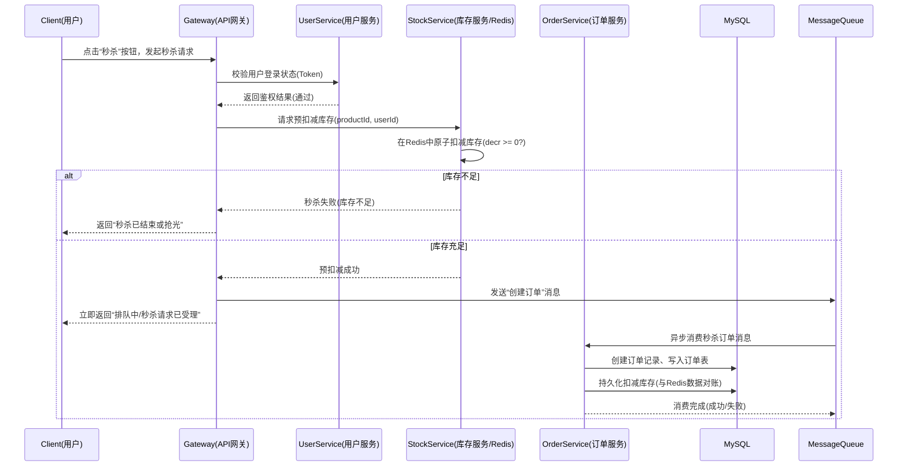

## 商品库存与秒杀系统 - 系统设计文档

### 1. 系统背景与目标

本系统为“分布式软件原理与技术”课程的作业项目，主要场景为**电商商品库存管理与秒杀活动**。通过该系统的设计与实现，目标是理解并初步实践分布式系统的“三高”目标：

- **高并发**：在秒杀场景下同时有大量用户请求下单、扣减库存。
- **高性能**：请求需在较短时间内完成响应，减少数据库压力。
- **高可用**：关键服务在高并发和部分组件故障时仍能持续提供服务。

本次作业在原有用户服务基础上，继续补全了“高并发读”相关能力，包括 Redis 商品详情缓存、缓存异常治理、MySQL 读写分离，以及可选 Elasticsearch 商品搜索。

---

### 2. 整体架构设计

系统采用**单体应用多实例部署 + 分层设计**的实现方式，对外通过 Nginx 暴露统一入口，在当前作业中重点实现用户服务与商品服务，并引入 Redis、MySQL 主从复制、可选 Elasticsearch 支撑高并发读场景。

当前部署拓扑如下：

- Nginx：统一入口，负责负载均衡和动静分离。
- Spring Boot `app1` / `app2`：两个后端实例，处理动态接口。
- MySQL Primary：承接写请求。
- MySQL Replica：承接读请求。
- Redis：缓存商品详情、空值占位和互斥锁。
- Elasticsearch（可选）：提供商品搜索能力。

业务模块仍按下述边界划分，方便后续继续拆分为独立微服务：

- **用户服务（User Service）**
  - 职责：用户注册、登录、鉴权、用户信息管理。
  - 依赖：MySQL 用户表、（后续）Redis 缓存、JWT/Session。

- **商品服务（Product Service）**
  - 职责：商品基本信息管理（名称、价格、描述、上下架状态等），提供商品列表与详情查询接口。
  - 依赖：MySQL 商品表、（后续）Redis 商品缓存。

- **库存服务（Stock Service）**
  - 职责：商品库存管理，提供库存查询、预扣减、回滚等接口；秒杀场景下的库存扣减控制，避免超卖。
  - 依赖：MySQL 库存表、Redis 缓存、（可选）分布式锁。

- **订单服务（Order Service）**
  - 职责：订单创建、状态流转（待支付/已支付/已取消）、与库存服务的交互。
  - 依赖：MySQL 订单表、（可选）消息队列。

可选支持组件：

- **API 网关（Gateway，可选）**：统一对外暴露接口，实现路由、鉴权、限流。
- **服务注册与配置中心（可选）**：例如 Spring Cloud Alibaba Nacos，用于服务发现与配置集中管理。
- **消息队列（MQ，可选）**：例如 RocketMQ / RabbitMQ / Kafka，用于削峰填谷、异步下单与库存更新。

在当前代码实现中，用户服务、商品服务以及读写分离/缓存逻辑已经可以直接运行和验收。

---

### 3. 核心 RESTful API 设计

以下为各服务的典型 RESTful 接口设计示例，采用 JSON 作为请求与响应的数据格式。

#### 3.1 用户服务 API

- **用户注册**
  - 方法：`POST /api/users/register`
  - 请求体：
    ```json
    {
      "username": "alice",
      "password": "123456",
      "phone": "13800000000"
    }
    ```
  - 响应：
    ```json
    {
      "code": 0,
      "msg": "success"
    }
    ```

- **用户登录**
  - 方法：`POST /api/users/login`
  - 请求体：
    ```json
    {
      "username": "alice",
      "password": "123456"
    }
    ```
  - 响应（简化示例，实际可返回 JWT Token）：
    ```json
    {
      "code": 0,
      "msg": "success",
      "data": {
        "token": "mock-token-for-alice"
      }
    }
    ```

#### 3.2 商品服务 API

- 获取商品列表
  - 方法：`GET /api/products/list`
  - 说明：当前作业中返回全部商品，便于演示主从读写分离与 ES 重建索引。

- 获取商品详情
  - 方法：`GET /api/products/{id}`
  - 说明：优先查 Redis，缓存未命中时回源数据库并回填缓存。

- 更新商品信息
  - 方法：`PUT /api/products/{id}`
  - 说明：走主库更新商品信息，并主动删除详情缓存，保证后续读取拿到新数据。

- 手动清理商品缓存
  - 方法：`DELETE /api/products/{id}/cache`
  - 说明：用于演示缓存重建、预热和压测前清理。

#### 3.3 库存服务 API（设计）

- 扣减库存（用于下单/秒杀）
  - 方法：`POST /api/stock/deduct`
  - 请求体：
    ```json
    {
      "productId": 1001,
      "amount": 1
    }
    ```

- 回滚库存
  - 方法：`POST /api/stock/rollback`

#### 3.4 订单服务 API（设计）

- 创建订单
  - 方法：`POST /api/orders/create`
  - 请求体：
    ```json
    {
      "userId": 1,
      "productId": 1001,
      "amount": 1
    }
    ```

- 查询订单详情
  - 方法：`GET /api/orders/{id}`

---

### 4. 数据库 ER 图与表结构设计

系统核心涉及四张主要业务表：`user`、`product`、`stock`、`order`。下面为简要说明。

#### 4.1 用户表 `user`

- `id`：主键，BIGINT，自增。
- `username`：用户名，唯一。
- `password`：密码（加密存储，建议使用 BCrypt）。
- `phone`：手机号。
- `status`：用户状态（1-正常，0-禁用）。
- `create_time`：创建时间。
- `update_time`：更新时间。

#### 4.2 商品表 `product`

- `id`：主键，BIGINT，自增。
- `name`：商品名称。
- `description`：商品描述。
- `price`：价格（DECIMAL）。
- `status`：上下架状态（1-上架，0-下架）。
- `create_time`：创建时间。
- `update_time`：更新时间。

#### 4.3 库存表 `stock`

- `id`：主键，BIGINT，自增。
- `product_id`：商品 ID（外键关联 `product.id`）。
- `total`：总库存数量。
- `available`：当前可用库存数量。
- `version`：乐观锁版本号，用于高并发扣减时避免超卖。
- `update_time`：更新时间。

#### 4.4 订单表 `order`

- `id`：主键，BIGINT，自增。
- `order_no`：业务订单号（可使用时间 + 随机数生成）。
- `user_id`：用户 ID（外键关联 `user.id`）。
- `product_id`：商品 ID（外键关联 `product.id`）。
- `amount`：购买数量。
- `status`：订单状态（0-待支付，1-已支付，2-已取消）。
- `create_time`：创建时间。
- `update_time`：更新时间。

#### 4.5 ER 关系简述

- `user (1) —— (n) order`
- `product (1) —— (n) order`
- `product (1) —— (1) stock`（或 1 对 0/1）

在最终文档中，可使用 ER 图工具（如 PowerDesigner、draw.io 等）绘制图形化 ER 图，并附在文档中。

---

### 5. 技术选型

结合课程内容与实际工程经验，本系统采用以下技术栈：

- **编程语言**：Java 17（可根据实际 JDK 版本调整）。
- **Web 框架**：Spring Boot 3.x。
- **持久层**：MyBatis（或 MyBatis-Plus），简化数据库访问。
- **数据库**：MySQL 8.x，用于存储核心业务数据。
- **缓存**（秒杀优化相关，可后续扩展）：Redis，用于缓存商品信息和库存、实现限流与分布式锁等。
- **消息队列**（可选，削峰填谷）：RocketMQ / RabbitMQ / Kafka，用于异步订单创建与库存更新。
- **认证与鉴权**：Spring Security + JWT（本作业阶段可先用简化版登录实现，后续扩展为标准 JWT）。
- **接口文档**：Springdoc OpenAPI / Swagger，用于自动生成接口文档。

技术选型理由：

- Spring Boot + MyBatis + MySQL 是业界主流的 Java Web 技术栈，生态完善，便于快速开发。
- Redis 和 MQ 的引入有助于支撑高并发、高性能的秒杀场景，符合课程对“三高”系统的要求。
- JWT + Spring Security 可以实现统一的登录态管理与接口权限控制，提高系统安全性。

---

### 6. 本次作业实现范围说明

为对应课程作业中的“高并发读”要求，本次代码已经实现以下内容：

1. 使用 Docker Compose 搭建 Nginx + 双实例 Spring Boot + MySQL 主从 + Redis + Elasticsearch（可选）的完整实验环境。
2. 实现用户注册、登录，以及商品列表、商品详情、商品更新接口。
3. 在商品详情接口中引入 Redis Cache Aside 缓存。
4. 通过空值缓存处理缓存穿透，通过 Redis 互斥锁和双重检查处理缓存击穿，通过 TTL 随机抖动处理缓存雪崩。
5. 通过 `@ReadOnly` 注解、AOP 和动态数据源实现代码层读写分离，并提供 `/api/meta/db/read` 与 `/api/meta/db/write` 验证接口。
6. 提供可选 Elasticsearch 商品搜索与全量重建索引接口。

后续可扩展内容：

- 继续拆分库存服务、订单服务，形成更清晰的微服务边界。
- 在库存服务中加入乐观锁、Lua 脚本或消息队列，支撑真正的秒杀扣减链路。
- 加入限流、熔断、降级和监控报警，进一步提升高并发下的稳定性。

---

### 7. 秒杀业务组件图与时序图

#### 7.1 秒杀业务组件图说明

秒杀场景下，主要涉及的组件如下：

- **客户端（浏览器 / App）**
  - 展示秒杀页面，发起“秒杀下单”请求。

- **API 网关 / 负载均衡（可选）**
  - 统一入口，将请求路由到后端秒杀服务或订单服务实例。

- **用户服务（User Service）**
  - 提供用户登录、鉴权能力，校验用户是否已登录、是否有秒杀资格。

- **商品服务（Product Service）**
  - 提供商品详情、秒杀活动信息（开始时间、结束时间、秒杀价格等）。

- **库存服务（Stock Service）**
  - 使用 Redis + MySQL 管理库存，在内存/缓存中进行**原子扣减**，防止超卖。

- **订单服务（Order Service）**
  - 接收秒杀成功请求，创建订单记录，异步或同步更新数据库。

- **Redis 缓存**
  - 存储商品秒杀库存、访问计数、用户是否已抢到标记等。

- **消息队列（MQ，可选）**
  - 将“秒杀请求”写入队列，由后台消费者顺序创建订单，实现削峰填谷。

在报告中可以配合一张组件图，表达“客户端 → 网关 → 秒杀/订单服务 → Redis/库存服务 → MQ → 订单服务/数据库”的调用关系。

#### 7.2 秒杀下单时序图（Mermaid）

下面是一个简化的秒杀下单流程时序图（可直接贴进 Markdown 渲染，或导出为图片）：



说明：

- 为了承受高并发，**库存的第一层校验在 Redis 完成**，只要 Redis 中扣减失败就立即返回给用户，不打 MySQL。
- 订单创建采用**异步消息队列**方式，让秒杀入口快速返回，后端慢慢落库，起到削峰作用。
- 订单服务在消费 MQ 消息时，需要再次对数据库中的库存进行校验和持久化扣减，确保最终一致性。

---

### 8. 高并发读优化实践

本次“高并发读”作业在现有系统基础上，从**容器化、负载均衡、动静分离与分布式缓存**四个方面进行了优化实践，目标是构建一个能够抵抗高并发读请求的稳健系统。

#### 8.1 容器化环境建设（Docker + docker-compose）

- **目标**
  - 通过容器将应用、数据库、缓存、网关环境标准化，方便一键启动与扩缩容。
- **实现要点**
  - 编写 `Dockerfile`，以 `eclipse-temurin:17` 作为基础镜像，构建并运行 Spring Boot 应用。
  - 编写 `docker-compose.yml`，在同一编排文件中统一管理：
    - `mysql`：MySQL 8.0，挂载 `sql/init.sql` 完成数据库初始化。
    - `redis`：Redis 7 作为分布式缓存。
    - `app1`、`app2`：两个后端应用实例，通过环境变量指定端口（8081/8082）和数据源地址。
    - `nginx`：Nginx 作为统一接入层。
  - 通过一条命令完成启动：
    - `docker-compose up -d --build`
- **PPT 可展示要点**
  - 一张“容器化架构图”：MySQL、Redis、应用实例、Nginx 全部跑在独立容器，通过 `docker-compose` 管理。
  - 一页列出关键服务与端口映射表。

#### 8.2 负载均衡实践（Nginx upstream）

- **目标**
  - 启动多个应用实例，通过 Nginx 的 `upstream` 模块实现**七层负载均衡**，线性提升整体处理能力。
- **实现要点**
  - 在 `docker-compose.yml` 中定义两个应用容器 `app1`、`app2`。
  - 在 `nginx.conf` 中配置上游集群：
    - `upstream seckill_backend { server app1:8081; server app2:8082; }`
  - Nginx 通过 `proxy_pass http://seckill_backend` 将 `/api/` 请求按**轮询（Round Robin）**分发到两个实例。
- **压测与验证思路**
  - 使用 JMeter 对 `http://localhost/api/products/{id}` 或用户接口进行压测。
  - 通过查看 `seckill-app-1`、`seckill-app-2` 容器日志，确认请求在两个实例之间大致均匀分布。
- **PPT 可展示要点**
  - 一张“负载均衡示意图”：客户端 → Nginx → app1/app2。
  - 一页对比单实例与双实例下的 QPS/响应时间（可以简单描述趋势，无需精准数据）。

#### 8.3 接入层优化：动静分离（Nginx 直接返回静态资源）

- **目标**
  - 将 HTML/CSS/JS/图片等静态资源从应用服务器剥离出来，由 Nginx 直接处理，从而降低后端压力、提升静态资源响应速度。
- **实现要点**
  - 在 `nginx/html` 目录准备静态首页 `index.html` 及样式文件。
  - 在 `nginx.conf` 中配置：
    - `/` 路由为静态资源入口，`root /usr/share/nginx/html; index index.html;`
    - 静态资源开启强缓存：`expires 30d;`
    - `/api/` 路由转发至后端应用集群。
- **压测与对比**
  - 使用 JMeter 分别压测：
    - 静态：`GET http://localhost/`
    - 动态：`GET http://localhost/api/products/{id}`
  - 对比响应时间和 CPU 占用，可以观察到静态请求几乎完全由 Nginx 处理，后端压力明显降低。
- **PPT 可展示要点**
  - 一张“动静分离结构图”：Nginx 直接服务静态资源，同时作为动态接口网关。
  - 一页简单的压测结果对比（静态 vs 动态）。

#### 8.4 分布式缓存与“三大缓存问题”治理（Redis）

- **目标**
  - 使用 Redis 对商品详情页进行缓存，大部分读请求不再访问数据库，并在此基础上处理缓存穿透、缓存击穿和缓存雪崩问题。

- **缓存读写模式：Cache Aside**
  - **读流程**：先读 Redis，如果未命中再查 MySQL，并将结果写回缓存。
  - **写流程**：先更新 MySQL，再删除 Redis 缓存对应 Key，确保数据最终一致性。

- **缓存穿透（请求大量不存在的商品 ID）**
  - 现象：对不存在的数据反复请求，每次都打到数据库。
  - 策略：当数据库中查不到商品时，在 Redis 中缓存 `"NULL"` 占位符，设置较短的过期时间（如 5 分钟），后续相同 ID 请求直接命中缓存，不再访问数据库。

- **缓存击穿（热点 Key 在某一时刻失效）**
  - 现象：某个超热点商品的缓存刚好过期，在高并发瞬间大量请求同时穿透到数据库。
  - 策略：
    - 对每个商品详情缓存 Key 设计一个简单的**分布式锁**（例如 Redis `SETNX` 带过期时间）。
    - 只有拿到锁的请求才允许访问数据库并重建缓存，其他请求要么等待重试，要么直接返回旧值。
    - 在本项目中，通过对 `product:detail:{id}` Key 增加 `:lock` 锁 Key 实现。

- **缓存雪崩（大量 Key 集中失效）**
  - 现象：大量数据设置了相同的过期时间，某一时刻集中失效，所有请求瞬间落到数据库。
  - 策略：
    - 在设置缓存 TTL 时，采用“基础时间 + 随机偏移”的方式。
    - 例如商品详情缓存 TTL = 3600 秒 + `random(0~300)` 秒，保证不同 Key 的过期时间分散开。

- **PPT 可展示要点**
  - 一页总结 Cache Aside 读写流程（简单时序箭头图）。
  - 三页分别说明**穿透 / 击穿 / 雪崩**的现象 + 策略（可以配合简易时序/示意图）。
  - 一页整体效果总结：Redis 命中率提升、数据库 QPS 降低的趋势描述。

